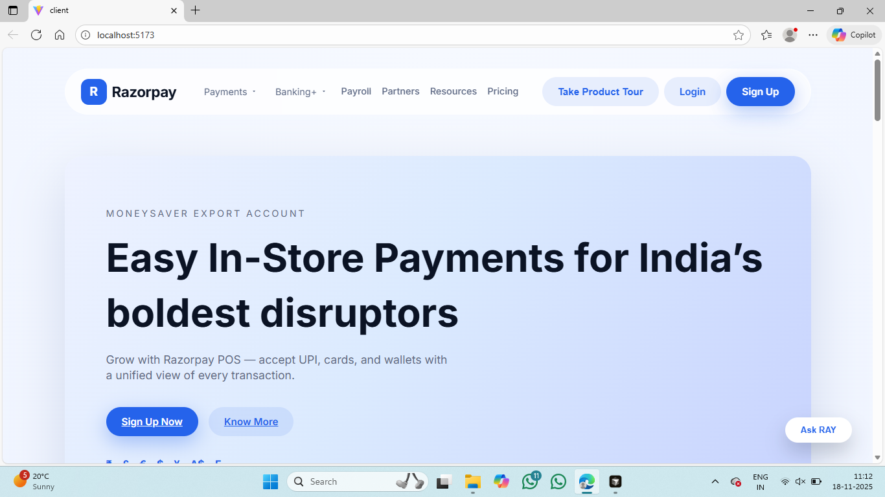
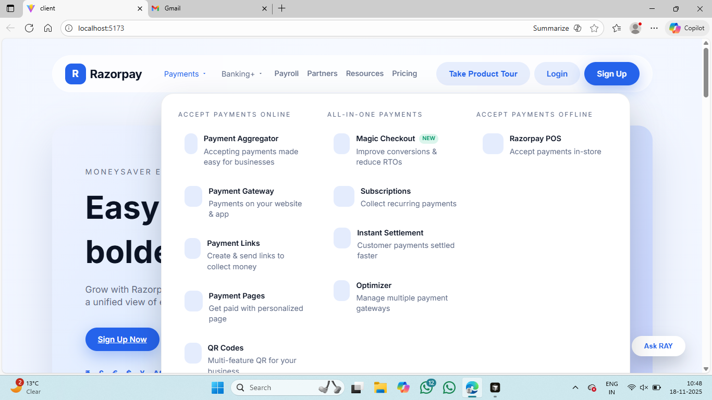
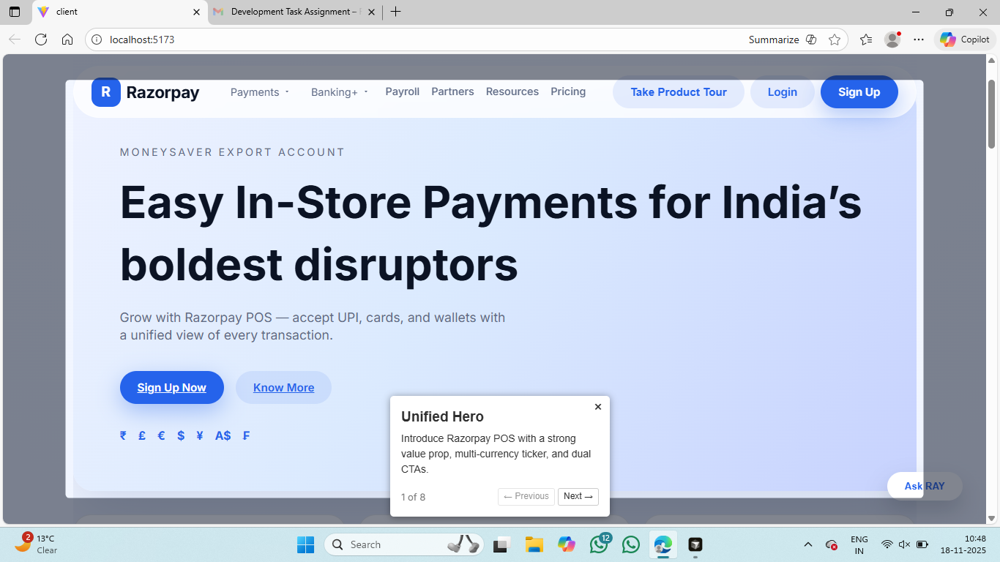
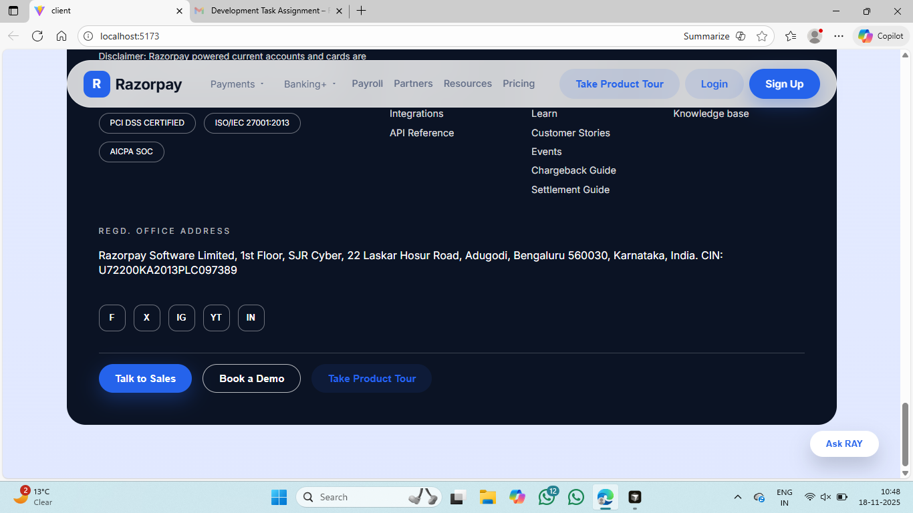

# Razorpay Payment Gateway - Client

A modern React application built with Vite for the Razorpay Payment Gateway interface. This project provides a complete UI for payment gateway services including landing pages, authentication, and product tours.

## Screenshots

| View | Preview |
| --- | --- |
| Landing Page Overview |  |
| Hero Section |  |
| Product Tour Overlay |  |
| Footer Section |  |

> Screenshots are stored in `client/screenshots`. Add more images to this folder and update the table above to showcase additional sections (features, FAQs, auth pages, etc.).

## Project Structure

```
Razerpay payment gateway/
└── client/
    ├── public/                 # Static assets
    │   └── vite.svg
    ├── src/
    │   ├── assets/            # Images, icons, and other static assets
    │   │   └── react.svg
    │   ├── components/        # Reusable React components
    │   │   ├── BankingDropdown.jsx    # Banking services dropdown menu
    │   │   ├── Faq.jsx                # Frequently Asked Questions component
    │   │   ├── FeatureGrid.jsx        # Features grid display
    │   │   ├── Footer.jsx             # Site footer component
    │   │   ├── Header.jsx             # Navigation header component
    │   │   ├── Hero.jsx               # Hero section component
    │   │   ├── LogoMarquee.jsx        # Scrolling logo marquee
    │   │   ├── PaymentDropdown.jsx    # Payment services dropdown menu
    │   │   ├── Solutions.jsx          # Solutions showcase component
    │   │   ├── Stats.jsx              # Statistics display component
    │   │   ├── SupportWidget.jsx      # Support chat widget
    │   │   └── Testimonials.jsx       # Customer testimonials component
    │   ├── hooks/             # Custom React hooks (currently empty)
    │   ├── pages/             # Page components
    │   │   ├── Auth.css              # Authentication page styles
    │   │   ├── Login.jsx             # Login page component
    │   │   └── Signup.jsx           # Sign up page component
    │   ├── App.css            # Main application styles
    │   ├── App.jsx            # Root application component with routing
    │   ├── index.css          # Global styles and CSS variables
    │   └── main.jsx           # Application entry point
    ├── dist/                  # Build output directory (generated)
    ├── node_modules/          # Dependencies (generated)
    ├── .gitignore            # Git ignore rules
    ├── eslint.config.js      # ESLint configuration
    ├── index.html            # HTML template
    ├── package.json          # Project dependencies and scripts
    ├── package-lock.json     # Locked dependency versions
    ├── README.md             # Project documentation
    └── vite.config.js        # Vite configuration
```

## Key Directories

### `/src/components`
Contains all reusable UI components:
- **Header.jsx**: Main navigation with mega menus for Payments and Banking+
- **Hero.jsx**: Landing page hero section with CTAs
- **FeatureGrid.jsx**: Displays key features in a grid layout
- **Solutions.jsx**: Showcases different payment solutions
- **Testimonials.jsx**: Customer testimonials section
- **Faq.jsx**: Expandable FAQ section
- **Footer.jsx**: Site footer with links and information
- **SupportWidget.jsx**: Fixed support chat button

### `/src/pages`
Contains page-level components:
- **Login.jsx**: User login page with social authentication options
- **Signup.jsx**: User registration page

### `/src`
Root source files:
- **App.jsx**: Main application component with React Router setup
- **App.css**: Application-wide styles and component styles
- **index.css**: Global styles, CSS variables, and base styles
- **main.jsx**: Application entry point that renders the root component

## Technologies Used

- **React 19.2.0**: UI library
- **Vite 7.2.2**: Build tool and dev server
- **React Router DOM 7.9.6**: Client-side routing
- **Driver.js 1.3.6**: Interactive product tour functionality
- **ESLint**: Code linting

## Scripts

- `npm run dev`: Start development server
- `npm run build`: Build for production
- `npm run preview`: Preview production build
- `npm run lint`: Run ESLint

## Git Setup & Workflow

### Initial Setup

1. **Install dependencies**
   ```bash
   npm install
   ```

2. **Start development server**
   ```bash
   npm run dev
   ```

### Common Git Commands

#### Basic Workflow
```bash
# Check current status
git status

# Add files to staging
git add .
git add <specific-file>

# Commit changes
git commit -m "Your commit message"

# Push to remote repository
git push origin <branch-name>

# Pull latest changes
git pull origin <branch-name>
```

#### Branch Management
```bash
# Create a new branch
git checkout -b feature/your-feature-name

# Switch to existing branch
git checkout <branch-name>

# List all branches
git branch

# List remote branches
git branch -r

# Delete a branch
git branch -d <branch-name>
```

#### Viewing Changes
```bash
# View changes in working directory
git diff

# View staged changes
git diff --staged

# View commit history
git log
git log --oneline

# View specific file history
git log -- <file-path>
```

#### Undoing Changes
```bash
# Unstage files (keep changes)
git reset HEAD <file>

# Discard changes in working directory
git checkout -- <file>

# Amend last commit
git commit --amend -m "New commit message"

# Revert a commit
git revert <commit-hash>
```

### .gitignore

The project includes a `.gitignore` file that excludes:
- `node_modules/` - Dependencies
- `dist/` - Build output
- Environment files (`.env`, `.env.local`, etc.)
- IDE/editor files
- OS-specific files
- Logs and temporary files

### Best Practices

1. **Commit Messages**: Write clear, descriptive commit messages
   ```
   feat: Add responsive navigation menu
   fix: Resolve mobile dropdown overflow issue
   style: Update button hover effects
   docs: Update README with git workflow
   ```

2. **Branch Naming**: Use descriptive branch names
   - `feature/feature-name` - For new features
   - `fix/bug-description` - For bug fixes
   - `docs/documentation-update` - For documentation
   - `refactor/code-improvement` - For refactoring

3. **Before Committing**:
   - Run `npm run lint` to check for code issues
   - Test your changes locally
   - Ensure the build succeeds with `npm run build`

4. **Regular Updates**:
   - Pull latest changes before starting work: `git pull origin main`
   - Keep your branch up to date with the main branch
   - Resolve conflicts promptly

### Contributing

1. Create a feature branch from `main`
2. Make your changes
3. Test thoroughly
4. Commit with descriptive messages
5. Push to your branch
6. Create a pull request for review


